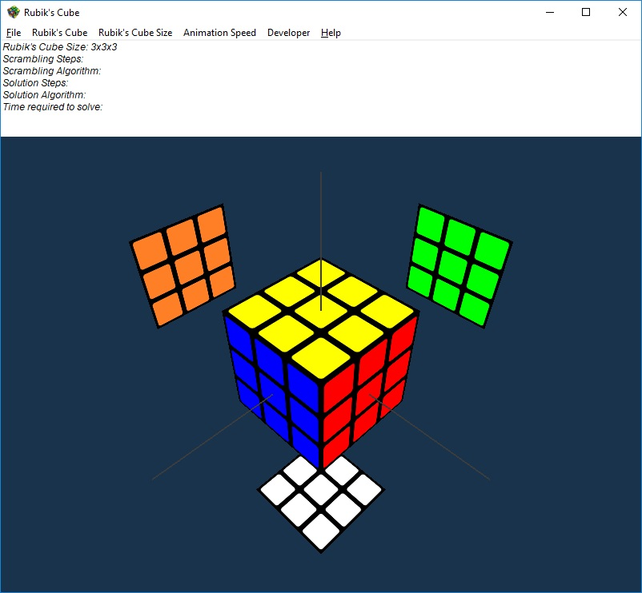

# **Rubik's Cube Solver**

### **MM_RubikCubeSolver** can solve any N x N x N Rubik's Cube!

## **How to use**
1. Clone or Download the entire "MM_RubikCubeSolver" repository.
2. Open MM_RubikCubeSolver/project_settings/windows_visual_studio/MM_RubikCubeSolver/MM_RubikCubeSolver.sln in Visual Studio 2017 or later.
3. If required, right click on "MM_RubikCubeSolver" in Solution Explorer and do "Retarget Projects" to select appropriate Windows SDK version.
4. Build and Run
5. Once launched, it will look like this:

6. Left Click on the empty space and drag to rotate the cube. Scroll mouse wheel to zoom in/out.
7. Explore the remaining Menu Options and Enjoy!

## **Some Maths**
* (to be updated...)

## **Rubik's Cube Solutions/Algorithms**
* (to be updated...)

## References:
* (to be updated...)
